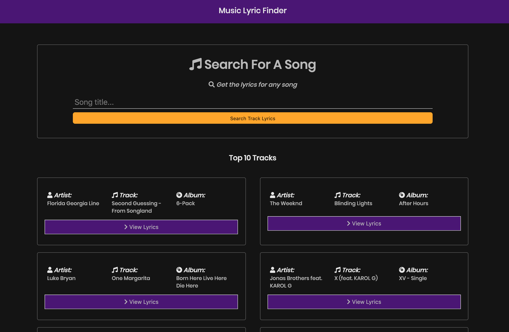

# Song Lyric Search App Using React

> A react web application for searching music lyrics using Reacts built in context API along with the Musixmatch public API. Please note that the free version of the API only returns partial lyrics.

## Musixmatch API

Get your API key [here](https://developer.musixmatch.com) and add it to the .ENV file.

## Quick Start

```
# Install dependencies
npm install

# Serve on localhost:3000
npm start

# Build for production
npm run build
```

## Motivation

I built this application to practice using React Router to build a single page application, Axios for making HTTP requests to talk with an API, and Reacts Context API to manage global state.

I learned how to use CSS modules in React to scope my css classes locally to each component (SUPER awesome).

I learned about Cross-Origin Resource Sharing (CORS) and why all modern browsers implement it ... and how to get around it using a proxy server, which was sufficient for my needs since this is only a small project with no user authentication and security is not a top priority.

I ran into some unexpected hurdles of using React Router. If I share a link with a track Id, that page wont load because the browser will look for a file that does not exist when in reality I want the browser to load my index file and then redirect to the correct component. This was a simple fix, I just redirect all traffic to the index file, and then in index the correct Route is loaded up. I also made sure to handle 404 requests.

## Screenshot

#### Homepage



## App Info

#### Author: [Jaime Lovera](https://github.com/jaimelovera)
